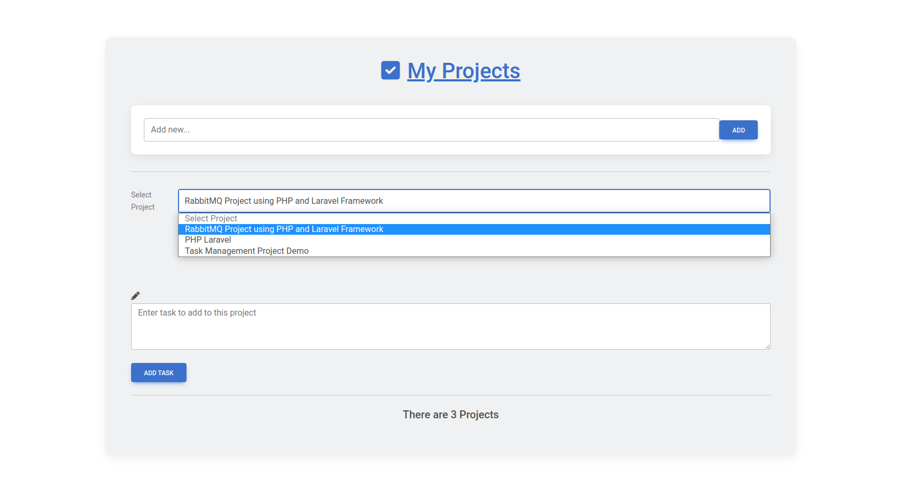
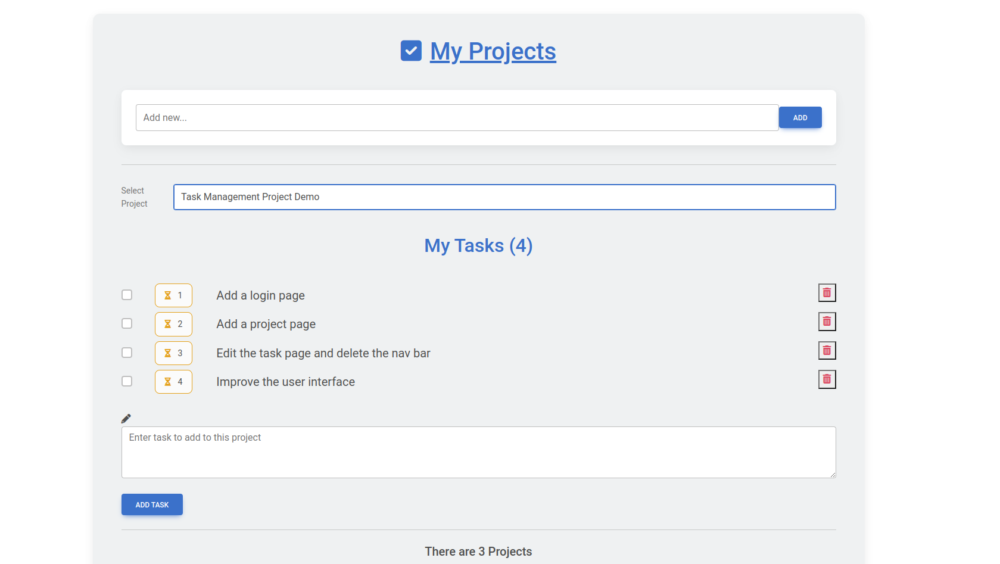
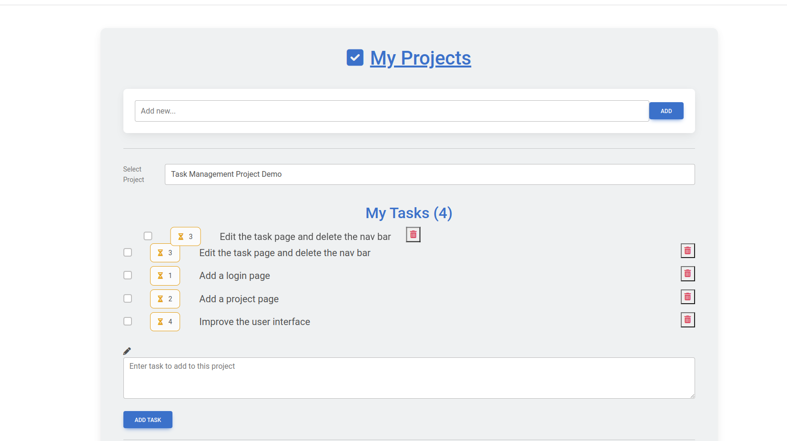

<p align="center"><a href="https://laravel.com" target="_blank"></a></p>

<p align="center">
<a href="https://github.com/laravel/framework/actions"></a>
<a href="https://packagist.org/packages/laravel/framework"></a>
<a href="https://packagist.org/packages/laravel/framework"></a>
<a href="https://packagist.org/packages/laravel/framework"></a>
</p>

# Laravel Task Manager

This project is a Task Manager built using Laravel and Livewire. It provides a simple yet effective way to manage tasks and track their progress.

## Features

- Create projects under which tasks can be asigned
- Create, update, and delete tasks
- Mark tasks as complete or incomplete
- Filter tasks by projects they belong to.
- sort task by prioroty in 1 being high priority tasks.
- Use mysql database to store and retrive data
- Form validation
- Responsive and user-friendly interface

## Requirements

Make sure you have the following requirements installed on your machine:

- PHP 7.4 or higher
- Composer
- Node.js and npm
- Laravel 8.x
- Laravel Livewire

## Installation

1. Clone the repository:
https://github.com/beast001/task-manager-demo

2. Navigate to the project directory:

3. Copy the `.env.example` file to `.env`:

4. Generate the application key:
`php artisan key:generate`
5. Configure the database settings in the `.env` file:
DB_CONNECTION=mysql
DB_HOST=127.0.0.1
DB_PORT=3306
DB_DATABASE=your_database_name
DB_USERNAME=your_username
DB_PASSWORD=your_password

6. Run the database migrations and seed the database:
```php
php artisan migrate --seed
```
7. Serve the application:
```php
php artisan serve
```
>Select a project to see the task associated with a particuler project


>View of the Task Page for a particuler project


>Drag and drop to view rearange task priority
